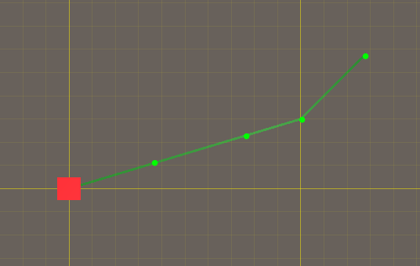

# Move

이동경로(Way Points) 를 기반으로 유닛을 이동시키고자 할 때

벡터의 내적을 이용해, 원하는 목표지점을 지나쳤는지 도착했는지 판단하고자 합니다.

</img>

## Youtube

https://youtu.be/4GNTPyMQqAk

## Compile

Unity 2020.3.2f1 를 기반으로 컴파일되도록 작성하였습니다.

## Description

- 크로스파이어 : RTS 전투모드에서 병사와 탱크를 이동시키는데 사용하고 있는 방식입니다.
